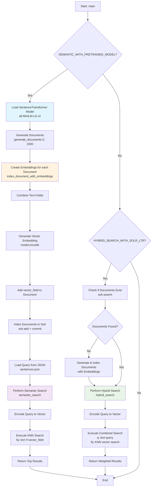

# Solr Automation Example

This is an example of how to automate Solr using the Solr API. 
The example is written in Python and uses the requests library to make HTTP requests to the Solr API.

### Setup local solr instance

Use the docker-compose file to set up a local Solr instance.

```bash
docker-compose up -d
```

### Workflow

1. Create the core with the name `core.py` script.
2. Update the schema with the `schema.py` script.
3. Create a document with the `document.py` script.
4. Test the document with the `query.py` script.
5. (Optional) Enable security with the `security.py` script.

## Schema

The schema is defined in the `schema.py` script. 
The schema defines the fields that are available in the Solr core.
You can adjust the schema to your needs. 

What you would do is add or remove fields from the schema. 
This is done via the json file `fields.json` and after wards executed by the `schema.py` script again.

## Machine Learning (PoC)

This script implements two different search approaches for Solr with machine learning capabilities.

### Key Functions

- index_document_with_embeddings():
    - Creates vector embeddings for documents by combining all text fields
- semantic_search():
    - Executes pure vector-based search using KNN
- hybrid_search():
    - Combines text and vector search with configurable weights
- load_solr_fields():
    - Loads field configuration from fields.json

### Semantic Search with Pretrained Model

- Model: Uses pre-trained all-MiniLM-L6-v2 SentenceTransformer model
- Process: Converts documents and queries into vector embeddings
- Search: Performs k-nearest-neighbor (KNN) search based on vector similarity
- Use Case: Best for finding semantically similar content regardless of exact keyword matches

### Hybrid Search with Solr LTR (Text + Vector)

- Approach: Combines traditional text search with vector-based search
- Text Component: Uses Solr's edismax parser for enhanced text matching
- Vector Component: KNN search as filter query for semantic similarity
- Weighting: Configurable balance between text and vector search results

### Workflow Overview



